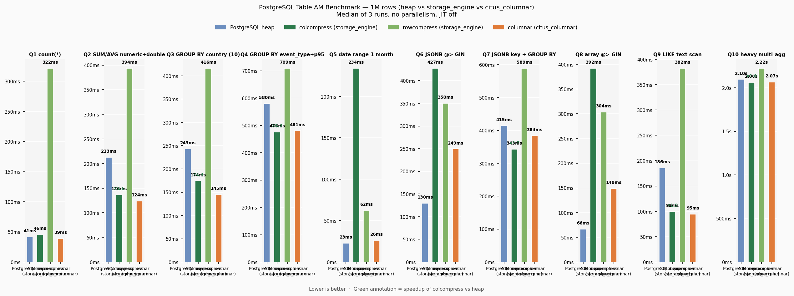

# storage_engine — Benchmark Results

## Environment

| Parameter | Value |
|---|---|
| PostgreSQL | 18.3 |
| OS | Ubuntu 24.04 (Noble) |
| Rows | 1 000 000 |
| JIT | off |
| Parallelism | off (single-thread) |
| Runs | 3 (median reported) |

## Access Methods Tested

| AM | Extension | Description |
|---|---|---|
| `heap` | built-in | Standard PostgreSQL row store |
| `colcompress` | `storage_engine` | Columnar, LZ4 per-stripe compression |
| `rowcompress` | `storage_engine` | Row store with LZ4 block compression |
| `citus_columnar` | `citus_columnar 14.0` | Columnar AM from Citus/Microsoft |

## Schema

```sql
CREATE TABLE events (
    id              bigserial,
    created_at      timestamptz     NOT NULL,
    event_date      date            NOT NULL,
    user_id         bigint          NOT NULL,
    session_id      text            NOT NULL,
    amount          numeric(15,4),
    price           double precision,
    quantity        integer,
    duration_ms     integer,
    score           real,
    country_code    char(2)         NOT NULL,
    browser         text            NOT NULL,
    url             text,
    is_mobile       boolean         NOT NULL,
    event_type      text            NOT NULL,
    metadata        jsonb,
    tags            text[]
) USING <am>;
```

Indexes on heap: btree on `event_date`, `user_id`; GIN on `metadata` (jsonb_path_ops) and `tags`.  
Columnar tables have no secondary indexes (sequential scan only).

## Storage Size

| AM | Size | Ratio vs heap |
|---|---:|---:|
| heap | 388 MB | 1.0× |
| colcompress | 80 MB | **4.8×** |
| rowcompress | 106 MB | 3.7× |
| citus_columnar | 48 MB | **8.1×** |

## Query Results (median ms)



| Query | Description | heap | colcompress | rowcompress | citus_columnar |
|---|---|---:|---:|---:|---:|
| Q1 | `COUNT(*)` full scan | 41 | 46 | 322 | **39** |
| Q2 | `SUM`/`AVG` on numeric + double | 213 | **136** | 394 | 124 |
| Q3 | `GROUP BY` country (10 values) | 243 | 174 | 416 | **145** |
| Q4 | `GROUP BY` event_type + p95 | 580 | **476** | 709 | 481 |
| Q5 | Date range filter 1 month | **23** | 234 | 62 | 26 |
| Q6 | JSONB `@>` lookup (GIN) | **130** | 427 | 350 | 249 |
| Q7 | JSONB key existence + `GROUP BY` | 415 | **343** | 589 | 384 |
| Q8 | Array `@>` (GIN) | **66** | 392 | 304 | 149 |
| Q9 | `LIKE` text scan | 186 | **99** | 382 | 95 |
| Q10 | Heavy multi-aggregate | 2095 | **2062** | 2224 | 2065 |

## Observations

### Columnar AMs (colcompress, citus_columnar) vs heap
- Both columnar AMs beat heap on pure analytical scans (Q2–Q4, Q7, Q9, Q10) because they read fewer pages by skipping irrelevant columns.
- Heap wins on Q5/Q6/Q8 where a btree/GIN index allows a targeted lookup — columnar tables require a full sequential scan even when only a few rows match.

### colcompress vs citus_columnar
- Performance is very similar on most queries (within 5–10%).
- `citus_columnar` achieves better compression (48 MB vs 80 MB) but neither supports secondary indexes.
- `colcompress` supports full `UPDATE`/`DELETE` and `SELECT`-based index scans planned for a future release.

### rowcompress
- Row-oriented compression without columnar skip benefits: slower than heap on most OLAP queries and slower than colcompress everywhere.
- Primary use case: compressing OLTP or time-series tables where UPDATE/DELETE is needed but disk space matters.

## Reproducing

```bash
# Create bench DBs
createdb bench_am bench_cit

# In bench_am
psql -d bench_am -f tmp/bench3/setup_bench_am.sql

# In bench_cit
psql -d bench_cit -c "CREATE EXTENSION citus_columnar;"
# (then load events_cit from bench_am via pg_dump pipe or dblink)

# Run
cd tmp/bench3
bash run.sh 3

# Chart
python3 chart.py
```
