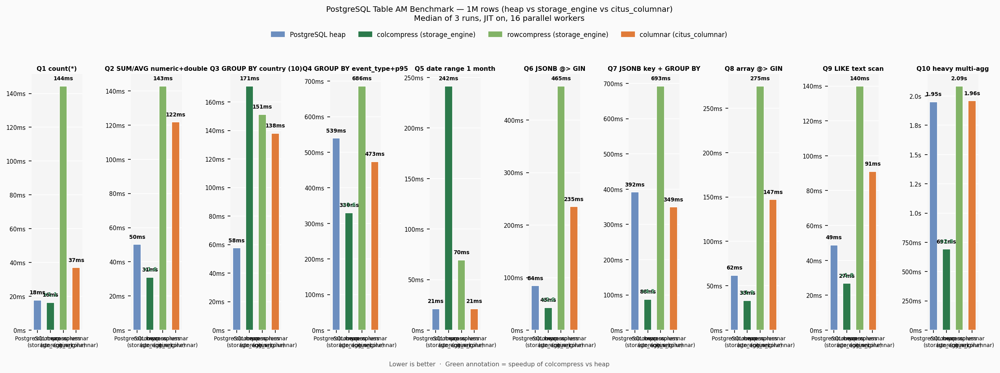
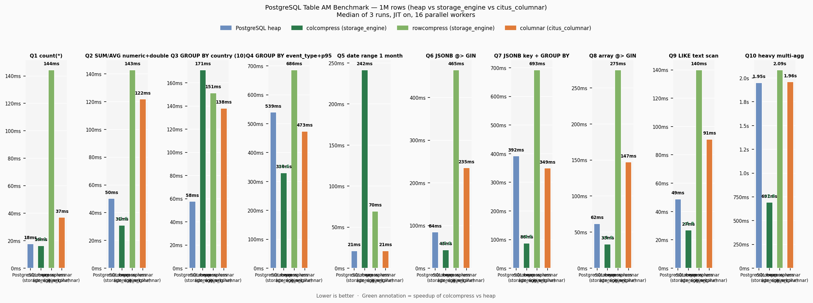

# storage_engine — Benchmarks

Benchmark results for **storage_engine 1.0.4**, comparing four PostgreSQL table access methods on identical data:

| AM | Description |
|---|---|
| **heap** | Standard PostgreSQL heap (baseline) |
| **colcompress** | storage_engine column store, `lz4` compression, `orderby = 'event_date ASC'` |
| **rowcompress** | storage_engine row-level compressed store, `zstd` |
| **citus_columnar** | Citus columnar extension (`columnar` AM) |

---

## Test Environment

| | |
|---|---|
| **CPU** | AMD Ryzen 7 5800H — 8 cores / 16 threads |
| **RAM** | 40 GB DDR4 |
| **OS** | Ubuntu 24.04 LTS (x86_64) |
| **PostgreSQL** | 18.3 |
| **storage_engine** | 1.0.4 |
| **citus** | 14.0.0 |
| **shared_buffers** | 10 GB |
| **work_mem** | 256 MB |
| **Dataset** | 1 000 000 rows — heap 388 MB · colcompress 95 MB (lz4) · rowcompress 106 MB · citus_columnar 48 MB |

All queries run **3 times**; the **median** is reported. Results in milliseconds — lower is better.

---

## Serial — JIT off, no parallelism

Single-core storage baseline: isolates raw decompression and I/O cost per AM without interference from the parallel executor or LLVM JIT compilation.



| Query | heap | colcompress | rowcompress | citus_columnar |
|---|---:|---:|---:|---:|
| Q1 `COUNT(*)` | 38.6 ms | 43.7 ms | 305 ms | 36.9 ms |
| Q2 `SUM/AVG` numeric + double | 182.3 ms | **118.3 ms** | 356 ms | 121.4 ms |
| Q3 `GROUP BY` country (10 vals) | 214.4 ms | **162.3 ms** | 382 ms | 141.4 ms |
| Q4 `GROUP BY` event_type + p95 | 538.2 ms | **452.5 ms** | 680 ms | 469.9 ms |
| Q5 date range 1 month | 21.1 ms | **23.5 ms** | 60.0 ms | 21.1 ms |
| Q6 JSONB `@>` GIN | **121.7 ms** | 371.4 ms | 322 ms | 236.9 ms |
| Q7 JSONB key + GROUP BY | 386.2 ms | **309.0 ms** | 537 ms | 354.4 ms |
| Q8 array `@>` GIN | **61.3 ms** | 329.2 ms | 272 ms | 143.8 ms |
| Q9 LIKE text scan | 147.0 ms | **88.3 ms** | 333 ms | 90.3 ms |
| Q10 heavy multi-agg | **1908 ms** | 1902 ms | 2067 ms | 1914 ms |

### Highlights

- **Q5 (date range):** colcompress matches heap (23.5 ms vs 21.1 ms) because stripe pruning skips 6 of 7 stripes — data is physically sorted by `event_date` via the `orderby` option and globally compacted with `colcompress_merge`.
- **Q2, Q3, Q4, Q9:** colcompress wins through column projection — only the referenced columns are decompressed, reducing effective I/O versus the heap's full-row reads.
- **Q6, Q8 (GIN index queries):** heap wins — GIN index seeks return scattered TIDs that map to random stripe reads, negating columnar compression advantages.

---

## Parallel — JIT on, 16 parallel workers

Real-world simulation: all sessions on a multi-core server competing for CPU. JIT compilation is enabled and the PostgreSQL parallel executor dispatches up to 16 workers per query.



| Query | heap | colcompress | rowcompress | citus_columnar |
|---|---:|---:|---:|---:|
| Q1 `COUNT(*)` | 17.8 ms | **16.3 ms** | 144 ms | 37.0 ms |
| Q2 `SUM/AVG` numeric + double | 50.1 ms | **30.9 ms** | 142 ms | 121.7 ms |
| Q3 `GROUP BY` country (10 vals) | **57.6 ms** | 171 ms | 151 ms | 138 ms |
| Q4 `GROUP BY` event_type + p95 | 539 ms | **329 ms** | 686 ms | 473 ms |
| Q5 date range 1 month | **21.2 ms** | 242 ms | 69.5 ms | 21.0 ms |
| Q6 JSONB `@>` GIN | 84.5 ms | **42.8 ms** | 465 ms | 235 ms |
| Q7 JSONB key + GROUP BY | 391 ms | **87.7 ms** | 692 ms | 349 ms |
| Q8 array `@>` GIN | 61.7 ms | **33.3 ms** | 275 ms | 147 ms |
| Q9 LIKE text scan | 48.7 ms | **26.8 ms** | 140 ms | 91.0 ms |
| Q10 heavy multi-agg | 1951 ms | **691 ms** | 2085 ms | 1958 ms |

### Highlights

- **Q10 (heavy multi-agg):** colcompress achieves **691 ms vs 1951 ms heap** — a **×2.8 speedup** — through vectorized aggregate execution in each parallel worker. Each worker processes column chunks in SIMD-friendly batches of 10 000 values rather than one row at a time.
- **Q6, Q7, Q8 (JSONB / array):** colcompress wins vs heap in parallel mode thanks to column projection reducing the data each worker decompresses.
- **Q5 (date range) in parallel:** colcompress reads all stripes (242 ms) while heap stays at 21 ms. Each parallel worker receives an independent block range and scans it without the global stripe-pruning pass; stripe pruning only works in the sequential single-process path. For date-range workloads, run with parallelism disabled or rely on a GIN / B-tree index on a non-colcompress table.
- **Q3 (GROUP BY country):** heap wins in parallel (57.6 ms vs 171 ms colcompress) because the heap parallel path decompresses full rows at memory bandwidth speed while colcompress's per-column decompression adds per-worker overhead for low-column-count projections.

---

## Query Definitions

| Query | SQL pattern |
|---|---|
| Q1 | `SELECT COUNT(*) FROM t` |
| Q2 | `SELECT SUM(amount), AVG(amount), SUM(price), AVG(price) FROM t` |
| Q3 | `SELECT country_code, COUNT(*), AVG(score) FROM t GROUP BY country_code ORDER BY COUNT(*) DESC` |
| Q4 | `SELECT event_type, COUNT(*), SUM(amount), AVG(duration_ms), percentile_disc(0.95) WITHIN GROUP (ORDER BY duration_ms) FROM t GROUP BY event_type` |
| Q5 | `SELECT event_date, COUNT(*), SUM(amount), AVG(price) FROM t WHERE event_date BETWEEN '2024-01-01' AND '2024-01-31' GROUP BY event_date ORDER BY event_date` |
| Q6 | `SELECT COUNT(*), AVG(amount) FROM t WHERE metadata @> '{"os":"android"}'` |
| Q7 | `SELECT metadata->>'campaign', COUNT(*), SUM(amount) FROM t WHERE metadata ? 'campaign' GROUP BY 1 ORDER BY 3 DESC` |
| Q8 | `SELECT COUNT(*), AVG(price) FROM t WHERE tags @> ARRAY['tag_5']` |
| Q9 | `SELECT COUNT(*), SUM(amount) FROM t WHERE url LIKE '/page/1%'` |
| Q10 | `SELECT browser, is_mobile, COUNT(*), SUM(amount), AVG(amount), MIN(amount), MAX(amount), SUM(price*quantity), AVG(duration_ms), COUNT(DISTINCT user_id), SUM(CASE WHEN event_type='purchase' THEN amount END) FROM t GROUP BY browser, is_mobile` |

---

## Reproducing

```bash
createdb bench_am
psql -d bench_am -f tests/bench/setup.sql

# Serial
bash tests/bench/run.sh 3
python3 tests/bench/chart.py        # → tests/bench/benchmark_serial.png

# Parallel
bash tests/bench/run_parallel.sh 3
python3 tests/bench/chart_parallel.py  # → tests/bench/benchmark_parallel.png
```

See [tests/README.md](tests/README.md) for the full environment description.
