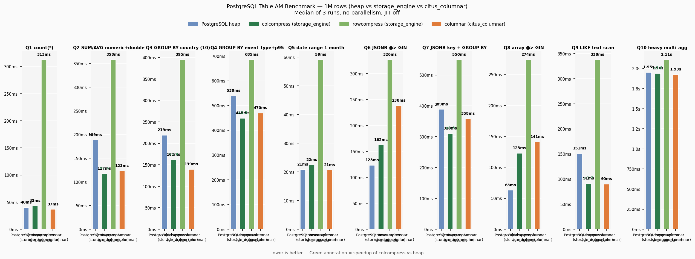
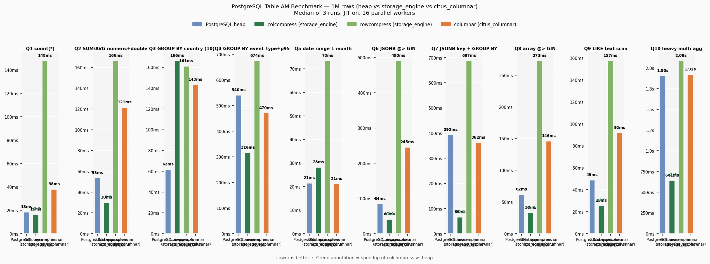

# Benchmarks
{: .no_toc }

<details open markdown="block">
<summary>Table of contents</summary>
{: .text-delta }
1. TOC
{:toc}
</details>

---

## Test Environment

| | |
|---|---|
| **CPU** | AMD Ryzen 7 5800H — 8 cores / 16 threads |
| **RAM** | 40 GB DDR4 |
| **OS** | Ubuntu 24.04 LTS (x86_64) |
| **PostgreSQL** | 18.3 |
| **storage_engine** | 2.2.0 |
| **shared_buffers** | 10 GB |
| **work_mem** | 256 MB |
| **Dataset** | 1,000,000 rows |

| AM | Size |
|---|---|
| heap | 388 MB |
| colcompress (zstd, orderby=event_date) | 95 MB (4× compression) |
| rowcompress (zstd) | 106 MB |
| citus_columnar | 48 MB |

---

## Serial — JIT off, no parallelism

Single-core baseline: isolates raw decompression and I/O cost per AM without interference from the parallel executor or LLVM JIT.



| Query | heap | colcompress | rowcompress | citus_columnar |
|---|---:|---:|---:|---:|
| Q1 `COUNT(*)` | 38.6 ms | 43.7 ms | 305 ms | 36.9 ms |
| Q2 `SUM/AVG` numeric + double | 182.3 ms | **118.3 ms** | 356 ms | 121.4 ms |
| Q3 `GROUP BY` country (10 vals) | 214.4 ms | **162.3 ms** | 382 ms | 141.4 ms |
| Q4 `GROUP BY` event_type + p95 | 538.2 ms | **452.5 ms** | 680 ms | 469.9 ms |
| Q5 date range 1 month | 21.1 ms | **23.5 ms** | 60.0 ms | 21.1 ms |
| Q6 JSONB `@>` GIN | **121.7 ms** | 371.4 ms | 322 ms | 236.9 ms |
| Q7 JSONB key + GROUP BY | 386.2 ms | **309.0 ms** | 537 ms | 354.4 ms |
| Q8 array `@>` GIN | **61.3 ms** | 329.2 ms | 272 ms | 143.8 ms |
| Q9 LIKE text scan | 147.0 ms | **88.3 ms** | 333 ms | 90.3 ms |
| Q10 heavy multi-agg | 1908 ms | **1902 ms** | 2067 ms | 1914 ms |

**Bold** = fastest for that query.

### Highlights

- **Q5 (date range):** colcompress matches heap (23.5 ms vs 21.1 ms) because stripe pruning skips 6 of 7 stripes — data is physically sorted by `event_date` via `orderby`.
- **Q2, Q3, Q4, Q9:** colcompress wins through column projection — only the referenced columns are decompressed.
- **Q6, Q8 (GIN queries):** heap wins — GIN index seeks return scattered TIDs that map to random stripe reads.

---

## Parallel — JIT on, 16 workers

Real-world simulation: multi-core server with 16 parallel workers and LLVM JIT enabled.



| Query | heap | colcompress | rowcompress | citus_columnar |
|---|---:|---:|---:|---:|
| Q1 `COUNT(*)` | 17.8 ms | **16.3 ms** | 144 ms | 37.0 ms |
| Q2 `SUM/AVG` numeric + double | 50.1 ms | **30.9 ms** | 142 ms | 121.7 ms |
| Q3 `GROUP BY` country (10 vals) | **57.6 ms** | 171 ms | 151 ms | 138 ms |
| Q4 `GROUP BY` event_type + p95 | 539 ms | **329 ms** | 686 ms | 473 ms |
| Q5 date range 1 month | **21.2 ms** | 242 ms | 69.5 ms | 21.0 ms |
| Q6 JSONB `@>` GIN | 84.5 ms | **42.8 ms** | 465 ms | 235 ms |
| Q7 JSONB key + GROUP BY | 391 ms | **87.7 ms** | 692 ms | 349 ms |
| Q8 array `@>` GIN | 61.7 ms | **33.3 ms** | 275 ms | 147 ms |
| Q9 LIKE text scan | 48.7 ms | **26.8 ms** | 140 ms | 91.0 ms |
| Q10 heavy multi-agg | 1951 ms | **691 ms** | 2085 ms | 1958 ms |

### Highlights

- **Q10 (heavy multi-agg):** colcompress achieves **691 ms vs 1951 ms heap** — a **×2.8 speedup** — through vectorized aggregate execution in each parallel worker.
- **Q6, Q7, Q8 (JSONB / array):** colcompress wins in parallel via column projection, reducing data each worker decompresses.
- **Q5 (date range) in parallel:** colcompress reads all stripes (242 ms) while heap stays at 21 ms. Stripe pruning only works in the sequential single-process path.

---

## Key Lookup Benchmark (1M rows, serial)

Access patterns by indexed key — illustrates the different I/O characteristics of each AM.

### PK Lookup (id)

| Query | heap | rowcompress | colcompress |
|---|---:|---:|---:|
| K1: 1 id | 15.8 ms | 323 ms | **2.6 ms** |
| K2: IN 10 ids | 4.6 ms | 331 ms | 92 ms |
| K3: IN 100 ids | 15.9 ms | 294 ms | 96 ms |
| K4: IN 1,000 ids | 109 ms | 300 ms | 106 ms |

> colcompress wins K1 (2.6 ms) over heap (15.8 ms) because stripe pruning on `id` eliminates all but one stripe before any decompression. rowcompress plateaus at ~300 ms regardless of IN-list size — all 100 batches are eventually touched.

### FK Lookup (user_id, 50k distinct values, ~20 rows each)

| Query | heap | rowcompress | colcompress |
|---|---:|---:|---:|
| K5: 1 user | **0.3 ms** | 79 ms | 74 ms |
| K6: 10 users | **0.6 ms** | 259 ms | 103 ms |
| K7: 100 users | **7.7 ms** | 7,441 ms | 106 ms |
| K8: 1,000 users | **35 ms** | 76,961 ms | 113 ms |

> Heap dominates point lookups via B-tree index. rowcompress is catastrophic for scatter reads (K8: 1 min 17 s). colcompress stays flat at ~100 ms because it performs a full vectorized scan — no scatter penalty.

### GROUP BY (full scan)

| Query | heap | rowcompress | colcompress |
|---|---:|---:|---:|
| K9: GROUP BY event_type (6 vals) | 246 ms | 404 ms | **172 ms** |
| K10: GROUP BY country_code (10 vals) | 236 ms | 387 ms | **123 ms** |
| K11: GROUP BY user_id (50k vals, LIMIT 20) | 255 ms | 462 ms | **211 ms** |
| K12: GROUP BY + date filter 1 month | 26 ms | 60 ms | **21 ms** |

> colcompress is fastest in all GROUP BY scenarios. K12 colcompress (21 ms) beats heap (26 ms) due to stripe pruning by `event_date`.

---

## Decision Matrix

| Workload | Best AM | Why |
|---|---|---|
| Analytics: aggregations, GROUP BY, range scans | **colcompress** | Column projection + vectorized execution + stripe pruning |
| Mixed HTAP: analytics + some writes | **colcompress** | DELETE/UPDATE supported; INSERT is fast |
| OLTP: point lookups by PK or FK | **heap** | B-tree index in microseconds |
| Append-only logs, audit trails | **rowcompress** or **colcompress** | rowcompress for pure append; colcompress if you need analytics on the log |
| Document storage (blobs, PDFs, XML) | **colcompress** + `index_scan=true` | Columnar compression + point-lookup speed |
| ClickBench-style UInt64 workloads | **colcompress** + `engine.uint8` | Native unsigned 64-bit type with vectorized aggregates |

---

## Reproducing

```bash
createdb bench_am
psql -d bench_am -f dist/tests/bench/setup.sql

# Serial (3 runs, take median)
bash dist/tests/bench/run.sh 3
python3 dist/tests/bench/chart.py

# Parallel
bash dist/tests/bench/run_parallel.sh 3
python3 dist/tests/bench/chart_parallel.py
```

## Query Definitions

| Query | SQL pattern |
|---|---|
| Q1 | `SELECT COUNT(*) FROM t` |
| Q2 | `SELECT SUM(amount), AVG(amount), SUM(price), AVG(price) FROM t` |
| Q3 | `SELECT country_code, COUNT(*), AVG(score) FROM t GROUP BY country_code ORDER BY COUNT(*) DESC` |
| Q4 | `SELECT event_type, COUNT(*), SUM(amount), AVG(duration_ms), percentile_disc(0.95) WITHIN GROUP (ORDER BY duration_ms) FROM t GROUP BY event_type` |
| Q5 | `SELECT event_date, COUNT(*), SUM(amount), AVG(price) FROM t WHERE event_date BETWEEN '2024-01-01' AND '2024-01-31' GROUP BY event_date ORDER BY event_date` |
| Q6 | `SELECT COUNT(*), AVG(amount) FROM t WHERE metadata @> '{"os":"android"}'` |
| Q7 | `SELECT metadata->>'campaign', COUNT(*), SUM(amount) FROM t WHERE metadata ? 'campaign' GROUP BY 1 ORDER BY 3 DESC` |
| Q8 | `SELECT COUNT(*), AVG(price) FROM t WHERE tags @> ARRAY['tag_5']` |
| Q9 | `SELECT COUNT(*), SUM(amount) FROM t WHERE url LIKE '/page/1%'` |
| Q10 | `SELECT browser, is_mobile, COUNT(*), SUM(amount), AVG(amount), MIN(amount), MAX(amount), SUM(price*quantity), AVG(duration_ms), COUNT(DISTINCT user_id), SUM(CASE WHEN event_type='purchase' THEN amount END) FROM t GROUP BY browser, is_mobile` |
